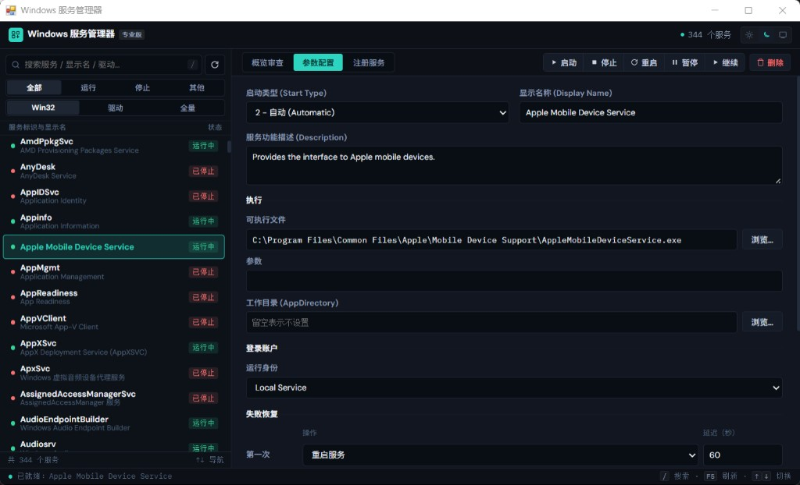

# Windows Service Editor

[](https://github.com/Paper-Dragon/WindowsServiceEditor/releases)
[](https://github.com/Paper-Dragon/WindowsServiceEditor/actions)
[](LICENSE)

基于 **pywebview + 现代 Web UI** 的 Windows 服务管理工具。单文件 `svc-edit.exe`，开箱即用，自动请求管理员权限。



## 功能亮点

| 功能 | 说明 |
|------|------|
| 快速搜索 | SCM 枚举，毫秒级加载，支持按服务名 / 显示名实时过滤 |
| 分类筛选 | 按状态（运行中 / 已停止 / 其他）和类型（Win32 / 驱动）筛选 |
| 详情查看 | 状态、PID、启动类型、延迟自动启动、显示名称、描述、可执行路径、登录账户、工作目录、服务依赖、失败恢复、环境变量 |
| 服务控制 | 启动、停止、重启、暂停、继续 |
| 编辑配置 | 启动类型、延迟自动启动、服务依赖、显示名、描述、可执行文件与参数、工作目录、登录账户、失败恢复、环境变量 |
| 创建服务 | 填写可执行文件后自动填充服务名和工作目录 |
| 程序变服务 | 将任意 `.exe` 包装为 Windows 服务，支持崩溃自动重启与节流 |
| 监控告警 | 后台监控指定服务，停止时应用内提醒 + 系统 Toast，可自动拉起 |
| 托盘常驻 | `--tray` 代理关闭主窗口后仍监控；支持计划任务开机自启（最高权限） |
| 删除服务 | 二次确认，自动停止运行中的服务后删除 |
| 主题切换 | 浅色 / 深色 / 跟随系统 |

> 启动时自动请求 **管理员权限**（UAC）。打包版 exe 已嵌入 `requireAdministrator` 清单。

## 下载

前往 [Releases](https://github.com/Paper-Dragon/WindowsServiceEditor/releases) 下载最新版：

| 文件 | 说明 |
|------|------|
| `svc-edit.exe` | 绿色免安装版，双击即用 |
| `svc-edit-setup.exe` | 引导式安装程序，含开始菜单 / 桌面快捷方式、卸载支持 |

无需安装 Python，无需安装任何依赖。

## 从源码运行

```bash
# 使用 uv（推荐）
uv sync
uv run python main.py

# 或直接使用 pip
pip install -r requirements.txt
python main.py
```

## 打包

```bash
# 打包绿色版 exe
pyinstaller app.spec

# 打包安装程序（需要 Inno Setup 6）
"C:\Program Files (x86)\Inno Setup 6\ISCC.exe" installer.iss
```

绿色版产物位于 `dist/svc-edit.exe`，安装程序产物位于 `dist/svc-edit-setup.exe`。

## 快捷键

| 快捷键 | 作用 |
|--------|------|
| `/` 或 `Ctrl+F` | 聚焦搜索框 |
| `F5` | 刷新服务列表 |
| `↑` / `↓` | 切换选定服务 |
| `Enter` | 切换至概览标签页 |

## 项目结构

```
main.py                 # 入口
installer.iss           # Inno Setup 安装程序脚本
app.spec                # PyInstaller 打包配置
svc_edit/
  app.py                # pywebview 窗口启动 / --service 宿主分发
  api.py                # JS API 桥接层
  services.py           # Windows SCM / 注册表操作
  wrapper.py            # 任意程序变服务（宿主 + 注册）
  monitor.py            # 服务监控告警引擎
  tray_agent.py         # 托盘常驻监控代理
  agent_ctl.py          # 托盘启停与开机自启
  notify.py             # 系统 Toast / UI 推送
  paths.py              # 本地配置与日志路径
  constants.py          # 常量定义
  elevate.py            # UAC 自动提权
web/
  index.html            # 前端页面
  app.js                # 前端逻辑
  style.css             # 样式
```

## 托盘监控

```bash
# 开发态启动托盘代理
uv run python main.py --tray

# 打包后
svc-edit.exe --tray
```

在「监控告警」页可启动/停止托盘常驻，并勾选开机自启（创建登录计划任务 `WindowsServiceEditorMonitor`）。

## 技术栈

- **Python** + **pywin32** — Windows 服务控制管理器 (SCM) 与注册表操作
- **pywebview** — 轻量级跨平台 WebView 容器
- **HTML / CSS / JS** — 现代化前端界面（无框架依赖）
- **PyInstaller** — 打包为单文件 exe
- **Inno Setup** — 生成引导式安装程序

## License

MIT
